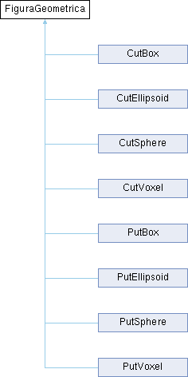

# Sculptor interpreter

## What is Sculptor

Sculptor is a C++ class created from sketch that can draw 3D sculptures with volume elements (voxels).

## His interpreter

Sculptor has the power of export `.OFF` files that can be imported on 3D softwares as [Meshlab](https://www.meshlab.net/) and [Geomview](http://www.geomview.org/) in order to draw the sculpture whose instructions are compiled on this sort of file.

But, before it exports that `OFF`, one must give Sculptor instructions such as cut/put an ellipsoid, a sphere, a voxel and a box. So, this repo hosts an inplementation of an interpreter that can read any text file - with valid instructions - and generate a `OFF` file related to it.

## Intepreter's structure

In order to built this Interpreter, one needed to refactor the Sculptor class into concrete and abstract classes.  The gist was to create an abstract class called `FiguraGeometrica`, and built concrete classes that represents the available methods on Sculptor. You can see the assembly of this structure on the diagram bellow



On that way, `Interpreter` class can make use of these classes for drawing and exporting any wished sculpture as long as the user write correctly his text file. Above an code that shows how you can use this interpreter.

```cpp

#include <iostream>
#include "headers/interpreter.h"

int main()
{
    Interpreter* sculpture; // calling interpreter
    sculpture = new Interpreter((char*) "assets/sample.txt"); // read instructions on sample.txt
    sculpture->exportf("assets/sample.off"); // export off

}
```

## Documentation

One can see the documentation of this interpreter [right here](https://raphaelramosds.github.io/sculptor/index.html).